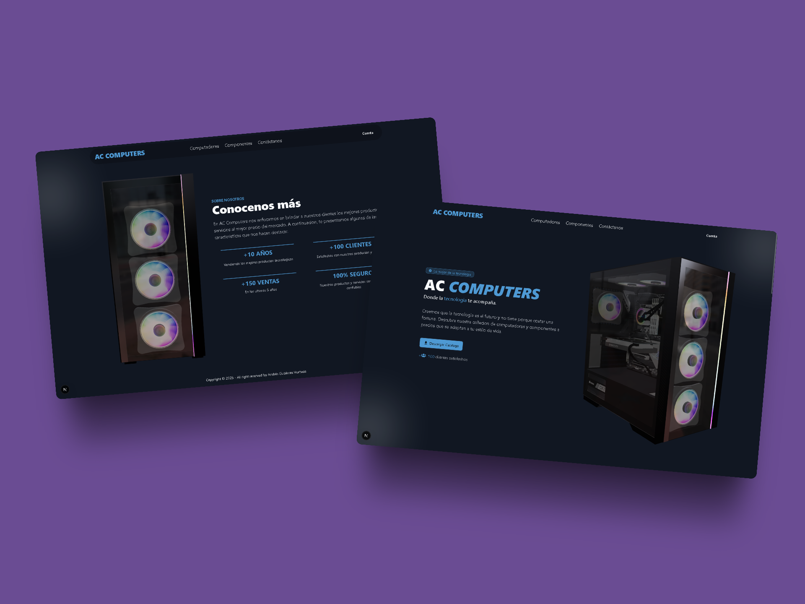
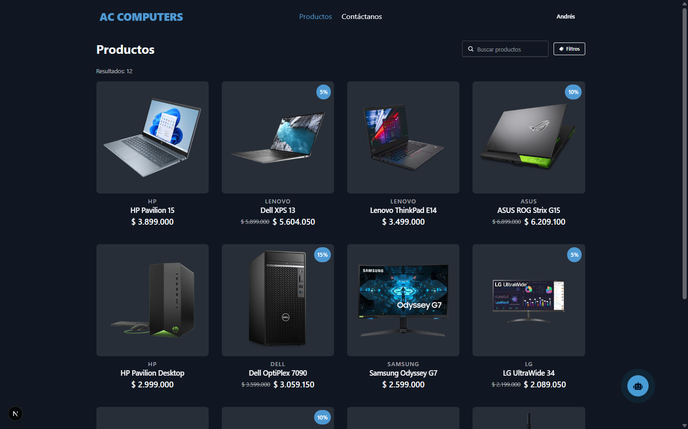
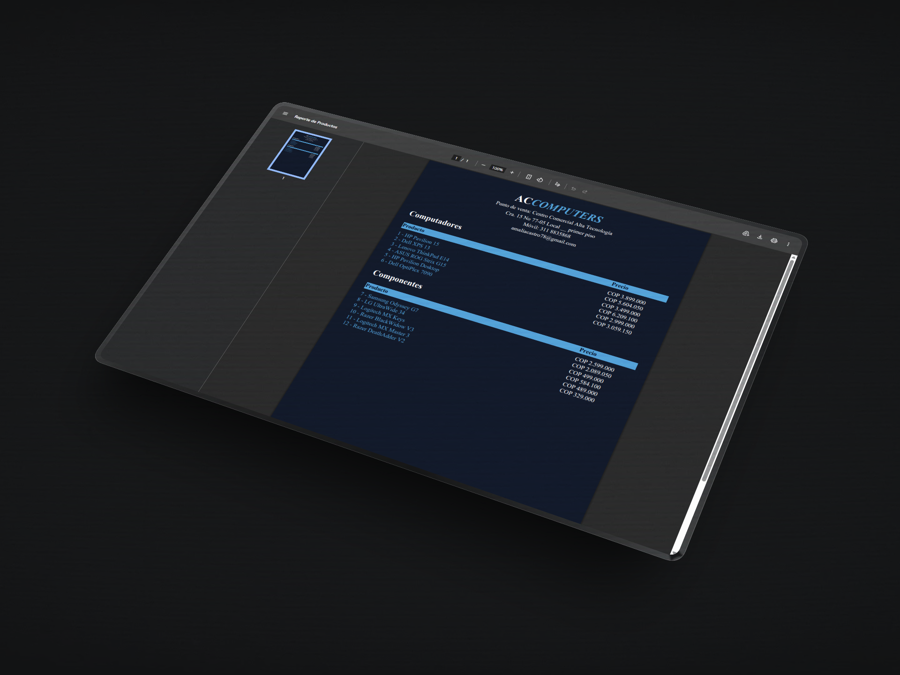
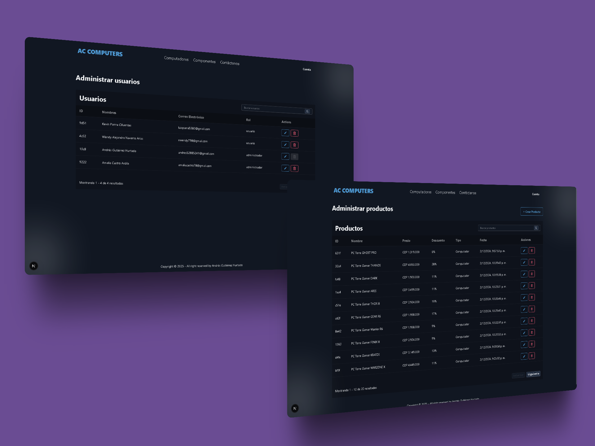
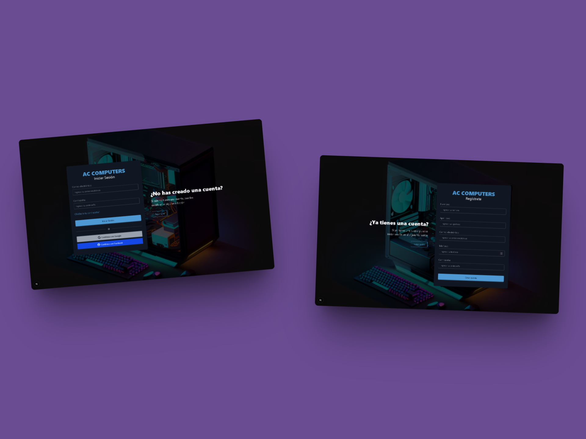
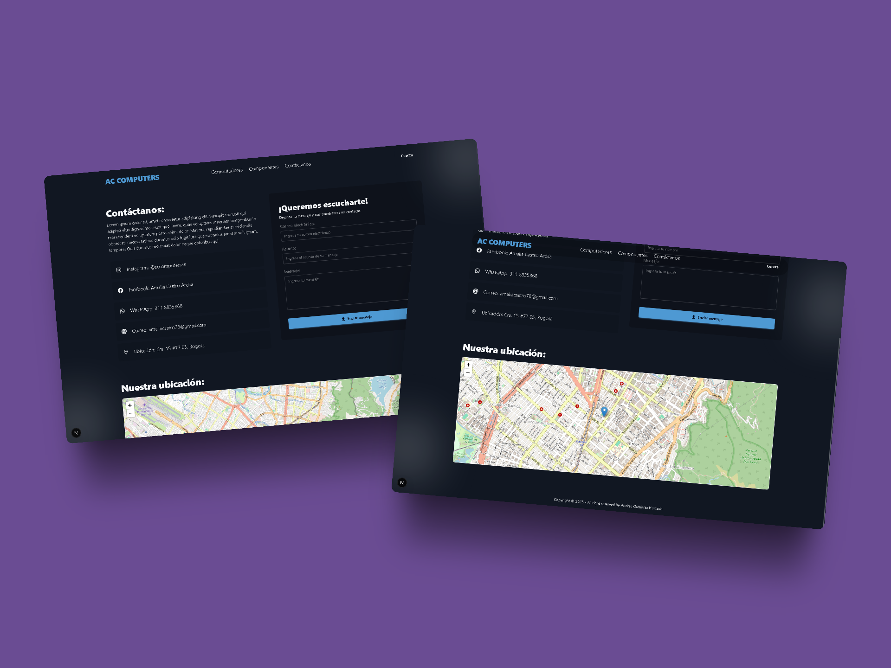
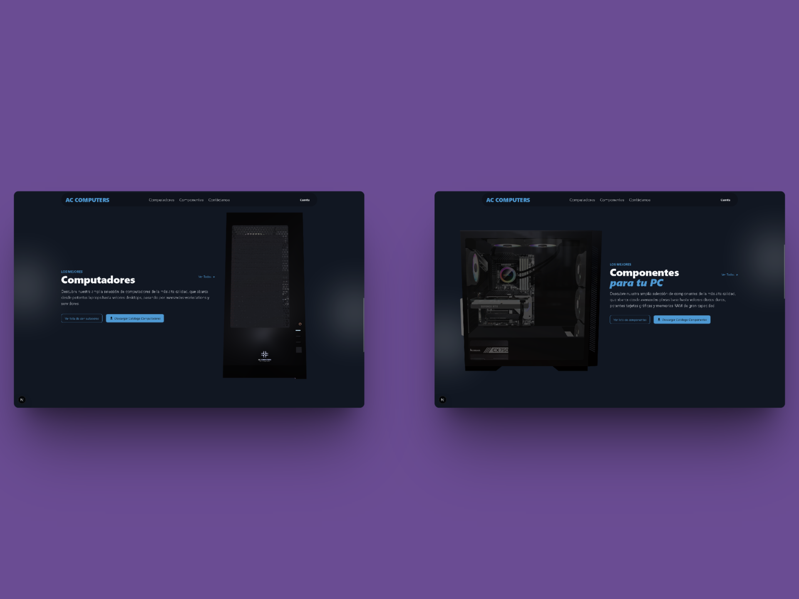

# 🖥️ AC Computers - Sistema de Catálogo de Productos

[English Version](./README.md)

Bienvenido al repositorio del **AC Computers**, una plataforma desarrollada para optimizar la gestión de productos tecnológicos, incluyendo computadores y componentes, y mejorar la interacción con los clientes mediante herramientas modernas y accesibles.

Este sistema está diseñado para:

-   Mostrar un catálogo interactivo de productos de manera clara y ordenada.
-   Permitir a los clientes descargar un catálogo en formato PDF.
-   Ofrecer un formulario de contacto para atención directa por correo electrónico.
-   Visualizar ubicaciones importantes mediante mapas interactivos.

Está orientado a mejorar la experiencia del usuario final y facilitar la administración de productos por parte del equipo de **AC Computers**.



---

## 📚 Tabla de Contenidos

-   [Características Principales](#-características-principales)
-   [Tecnologías Utilizadas](#️-tecnologías-utilizadas)
-   [Arquitectura del Proyecto](#-arquitectura-del-proyecto)
-   [Flujos de Uso](#️-flujos-de-uso)
-   [Estructura de Carpetas](#-estructura-de-carpetas)
-   [Instalación](#-instalación)
-   [Contacto](#-contacto)

---

## 🚀 Características Principales

1. **Catálogo de Productos y PDF Personalizado**

-   Visualización de productos con detalles como nombre, precio, descuento y disponibilidad en tiempo real.
-   Acceso directo a las páginas individuales de cada producto para una descripción más detallada.
-   Descarga de un catálogo en formato PDF con diseño atractivo y adaptado a la identidad de la marca.




2. **Gestión de Inventario**

-   CRUD completo de productos: Crear, Leer, Actualizar y Eliminar.
-   Panel administrativo protegido para la gestión eficiente del inventario.
-   Almacenamiento de imágenes optimizado mediante integración con **Cloudinary**.



3. **Gestión de Usuarios**

-   Sistema de autenticación seguro para registro e inicio de sesión.
-   Perfiles de usuario totalmente editables.
-   Panel de control para gestionar usuarios, asignar roles y administrar permisos.



4. **Contacto y Atención al Cliente**

-   Formulario de contacto conectado vía correo electrónico para consultas rápidas.
-   Notificaciones automáticas al administrador al recibir un nuevo mensaje.
-   Mapa interactivo utilizando **Leaflet** para mostrar la ubicación de la empresa o puntos de venta.



5. **Diseño Moderno y Experiencia Interactiva**

-   Interfaz responsiva construida con **Tailwind CSS** y **Next.js** para una navegación ágil y profesional.
-   Integración de **Three.js** para incorporar gráficos y animaciones 3D que elevan la experiencia del usuario.
-   Diseño adaptado para ofrecer una excelente experiencia tanto en dispositivos móviles como en desktop.



---

## 🛠️ Tecnologías Utilizadas

**Frontend**

-   React.js
-   Tailwind CSS
-   Three.js
-   DaisyUI
-   Leaflet.js

**Backend**

-   Node.js
-   Express.js
-   Sequelize ORM
-   PostgreSQL
-   Puppeteer / Chromium

**Despliegue**

-   Vercel
-   Docker

---

## 🧱 Arquitectura del Proyecto

El proyecto sigue una estructura basada en el patrón **Cliente-Servidor**, separando claramente la lógica del negocio, la presentación y el manejo de rutas.


---

## 🔄️ Flujos de Uso

### Usuario

-   **Navegación Pública:** Accede sin necesidad de registrarse o iniciar sesión.
-   **Visualización del Catálogo:** Consulta el catálogo de productos organizado en categorías, con filtros por nombre, precio o disponibilidad.
-   **Detalle del Producto:** Accede a una página individual de cada producto donde podrá ver descripciones detalladas, imágenes en alta calidad y precios con descuentos aplicados.
-   **Descarga del Catálogo en PDF:** Genera y descarga un catálogo actualizado en formato PDF con toda la información de los productos disponibles.
-   **Formulario de Contacto:** Envía consultas, cotizaciones o solicitudes de información directamente al equipo de soporte, recibiendo confirmaciones automáticas.
-   **Mapa Interactivo:** Visualiza la ubicación exacta de la tienda o puntos de distribución mediante Leaflet, permitiendo obtener rutas o referencias.

### Administrador

-   **Inicio de Sesión Seguro:** Accede al panel administrativo mediante autenticación protegida.
-   **Gestión Completa de Productos:**
    -   Crear nuevos productos con imágenes almacenadas en **Cloudinary**.
    -   Editar información de productos existentes como nombre, precio, stock y características técnicas.
    -   Eliminar productos obsoletos del catálogo de manera segura.
    -   Ver un listado general y detallado de todos los productos registrados.
-   **Gestión de Imágenes:**
    -   Carga de imágenes optimizadas y almacenamiento externo en **Cloudinary** para un rendimiento óptimo.
-   **Gestión de Usuarios:**
    -   Visualizar lista de usuarios registrados.
    -   Editar datos de perfil de usuarios.
    -   Asignar o cambiar roles de acceso (usuario o administrador).
-   **Recepción de Mensajes de Contacto:**
    -   Visualizar en el panel administrativo los mensajes recibidos a través del formulario de contacto.
    -   Gestionar solicitudes de los clientes de forma rápida y ordenada.
-   **Supervisión General:**
    -   Monitorear el estado general de la plataforma.
    -   Asegurar el correcto funcionamiento del catálogo, formularios y almacenamiento de datos.

---

## 📂 Estructura de carpetas

```
src/
├── app/                        # Directorio principal que contiene el enrutador y la API
|   ├── api/                    # Aquí se encuentran las rutas de la API
├── database/                   # Contiene todo lo relacionado con la base de datos, como modelos, seeders, migraciones y configuración
|   ├── models/                 # Modelos de la base de datos que definen la estructura de las tablas
|   ├── seeders/                # Seeders para poblar la base de datos con datos de prueba
|   ├── migrations/             # Migraciones para actualizar la estructura de la base de datos
|   └── config.cjs              # Archivo de configuración de la base de datos
├── components/                 # Componentes reutilizables de la interfaz de usuario
├── hooks/                      # Hooks personalizados para manejar lógica de negocio
|   └── useGetClientData.js     # Hook para obtener datos desde componentes para cielnte
├── layouts/                    # Estructuras de disposición de la aplicación, como páginas o plantillas
```

---

## 💾 Instalación

### Requisitos Previos

-   Node.js >= 18
-   PostgreSQL
-   Git

### Pasos

1. Clonar el repositorio:

```bash
git clone https://github.com/AndresGutierrezHurtado/ac-computers.git
```

2. Instalar dependencias:

```bash
npm install
```

3. Configurar variables de entorno:
   Crear un archivo `.env` basado en `.env.example`.

4. Ejecutar migraciones y sembrado de datos:

```bash
npm run db:migrate
npm run db:seed
```

5. Iniciar el servidor:

```bash
npm run dev
```

---

## 📬 Contacto

Para preguntas, soporte o colaboración, por favor contacta:

-   Andrés Gutiérrez Hurtado
-   Correo: [andres52885241@gmail.com](mailto:andres52885241@gmail.com)
-   LinkedIn: [Andrés Gutiérrez](https://www.linkedin.com/in/andr%C3%A9s-guti%C3%A9rrez-hurtado-25946728b/)
-   GitHub: [@AndresGutierrezHurtado](https://github.com/AndresGutierrezHurtado)
-   Portafolio: [Link portafolio](https://andres-portfolio-b4dv.onrender.com)
