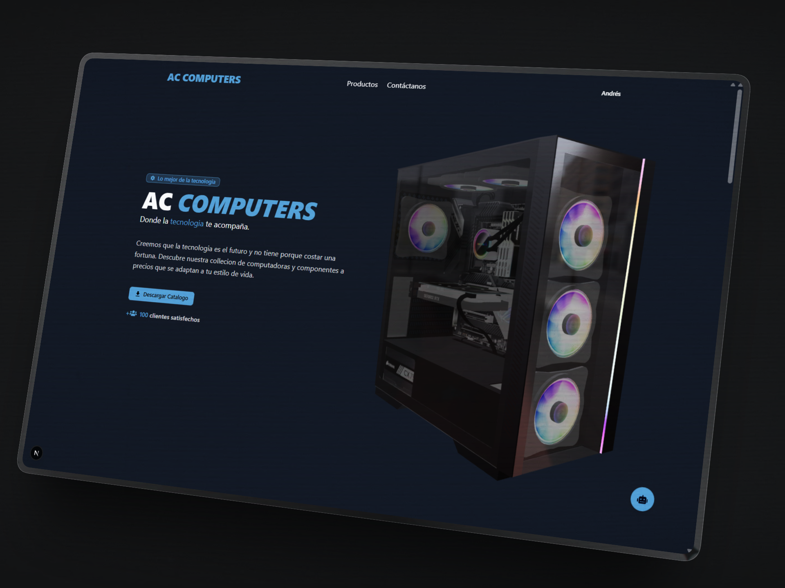
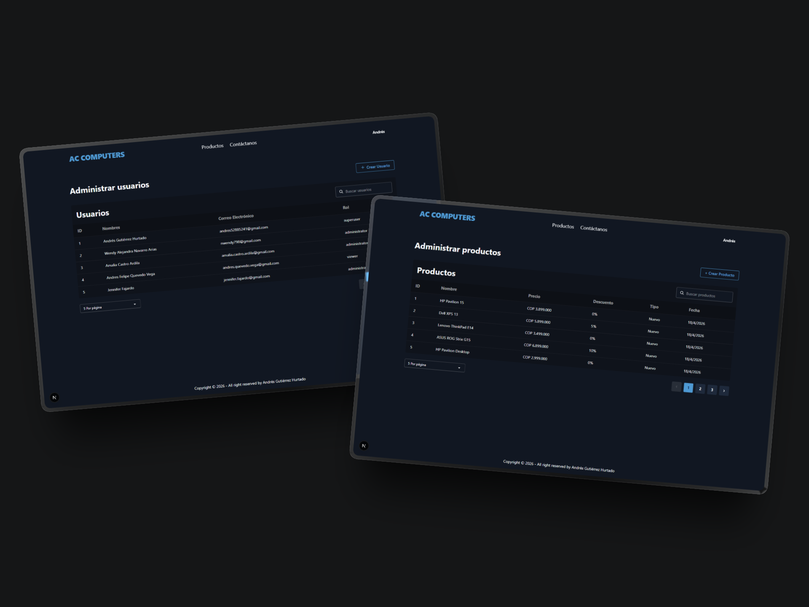
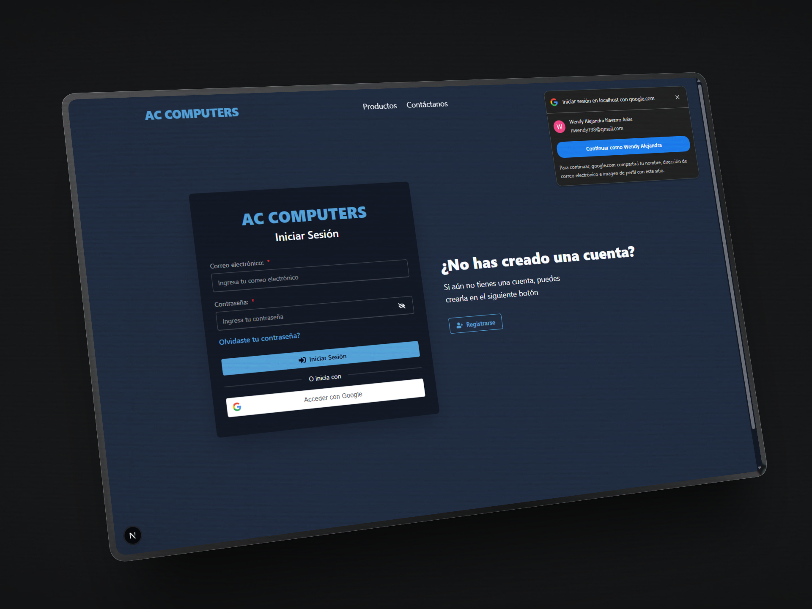
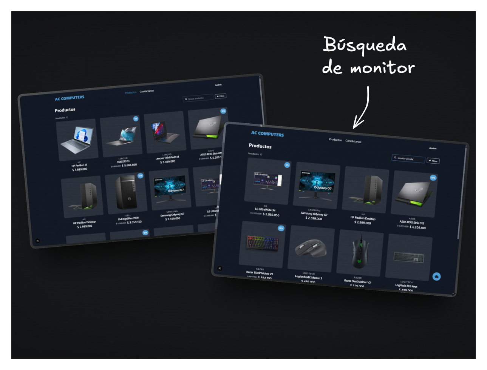
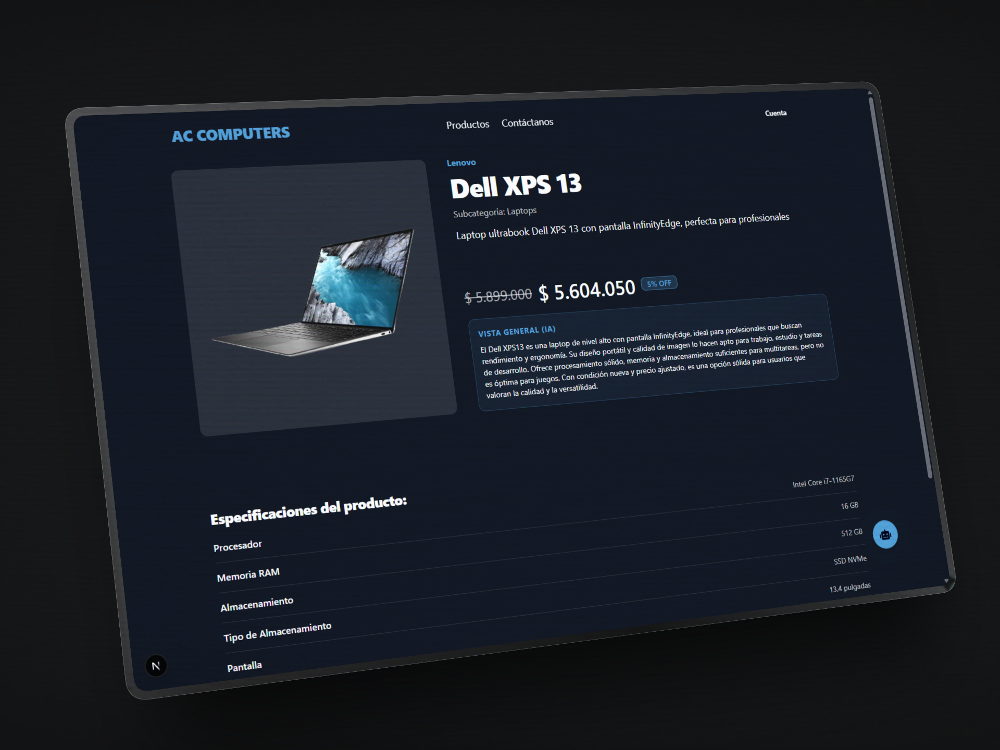
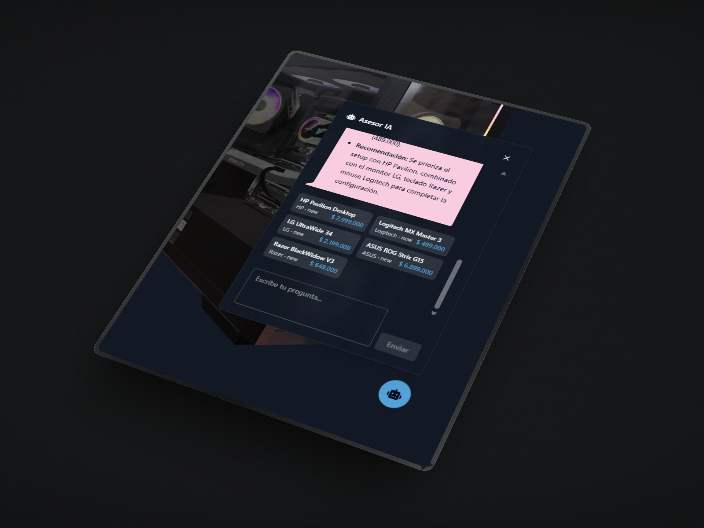

# 💻 AC Computers

AC Computers es una aplicación web orientada a la gestión, visualización y comercialización de productos tecnológicos, incluyendo computadores, periféricos y componentes. El sistema integra un catálogo dinámico con capacidades avanzadas de búsqueda, interacción mediante inteligencia artificial y generación automatizada de contenido como fichas técnicas y documentos PDF.

El problema que aborda es la fragmentación entre catálogos estáticos, sistemas de gestión de inventario y experiencias de usuario poco interactivas. Esta solución centraliza la gestión de productos, mejora la exploración mediante filtros y búsqueda semántica, y optimiza la conversión mediante asistentes inteligentes.

</img>

---

## 📑 Tabla de contenidos

- [Características Principales](#características-principales)
- [Tecnologías Utilizadas](#tecnologías-utilizadas)
- [Arquitectura](#arquitectura)
- [Flujo de Uso](#flujo-de-uso)
- [Instalación](#instalación)
- [Contacto](#contacto)

---

## ✨ Características Principales

- **Gestión dinámica de usuarios y productos:** Administración integral de las entidades del sistema, permitiendo crear, actualizar y eliminar información de forma controlada y consistente. Incluye autenticación con Google mediante One Tap Login, simplificando el acceso y reduciendo fricción en el registro e inicio de sesión.

</img>

</img>

- **Contacto y presencia digital:** Integración de envío de correos, enlaces a redes sociales y visualización de ubicación en mapas. La interfaz se complementa con animaciones por scroll y elementos 3D que mejoran la experiencia y percepción visual.

</img>

- **Catálogo estructurado de productos:** Listado organizado de computadores, periféricos y componentes con categorización jerárquica. Incorpora búsqueda semántica basada en embeddings para interpretar la intención del usuario, junto con filtros por precio y características que optimizan la exploración.

</img>

- **Vista detallada de productos:** Página completa con imágenes, descripción, categoría, subcategoría, marca y especificaciones técnicas. Incluye un resumen generado por IA que traduce la información técnica en beneficios claros para el usuario.

</img>

- **Generación de catálogos en PDF:** Creación automatizada de documentos PDF con información de productos, facilitando su distribución y consulta offline.

</img>

- **Chat de inteligencia artificial para ventas:** Asistente conversacional que responde preguntas y recomienda productos apoyándose en el sistema de búsqueda interna, mejorando la toma de decisiones del usuario.

</img>

---

## 🛠️ Tecnologías Utilizadas

**Frontend:**

- TypeScript
- React
- TailwindCSS v4
- DaisyUI
- GSAP
- Leaflet
- Valibot

**Backend:**

- Java 21
- Spring Boot
- iTextPDF
- Cloudinary SDK
- Ollama (integración IA)
- Caffeine

---

## 🏗️ Arquitectura

El sistema adopta arquitectura hexagonal, lo que implica que el núcleo del negocio permanece aislado de detalles técnicos como frameworks, bases de datos o servicios externos. Esto permite escalar, reemplazar componentes o cambiar proveedores sin afectar la lógica central.

### Capa de Dominio

Aquí reside el núcleo del sistema. Contiene entidades y reglas de negocio. No depende de librerías externas. Las validaciones críticas se definen en esta capa para garantizar consistencia de datos sin importar el origen.

### Capa de Aplicación

Orquesta los casos de uso y define cómo interactúan las distintas partes del sistema. Coordina operaciones como búsqueda de productos, generación de PDFs o ejecución de flujos del chat de IA. No contiene lógica de negocio compleja, sino que delega al dominio.

### Capa de Infraestructura

Implementa los detalles técnicos como acceso a base de datos, almacenamiento en la nube, envío de correos y motores de embeddings. Aquí también se integran mecanismos de caché mediante Caffeine para optimizar el rendimiento en consultas frecuentes.

El monitoreo y trazabilidad se gestionan mediante logging estructurado, permitiendo auditar el comportamiento del sistema y detectar fallos con precisión.

La seguridad se implementa mediante control de acceso basado en roles (RBAC), restringiendo operaciones según permisos definidos y protegiendo recursos críticos.

El uso de patrones como Mapper permite desacoplar el dominio de los modelos de persistencia, evitando dependencias innecesarias.

### Frontend

El frontend sigue Atomic Design, organizando la interfaz en átomos, moléculas, organismos y vistas. Esta estructura permite construir interfaces complejas a partir de componentes pequeños y reutilizables.

La comunicación con el backend se realiza mediante APIs, manteniendo el frontend desacoplado de la lógica de negocio. Esto facilita la evolución independiente de ambas capas.

---

## 🔁 Flujo de Uso

El usuario accede a la plataforma y primero ve un modelo 3d con animaciones de scroll donde ve lo importante que es la opcion de descargar el catalogo en pdf.

Arriba hay un menu donde puede ir a la visual de contacto y productos. En la seccion de producto puede explora el catálogo de productos utilizando filtros por precio, categoría o características.

Al seleccionar un producto, accede a una vista detallada con información completa y un resumen generado automáticamente que facilita la comprensión rápida.

Si el usuario tiene dudas, puede interactuar con el chat de inteligencia artificial, que utiliza búsqueda vectorial para recomendar productos relevantes según su intención.

El usuario puede contactar directamente al proveedor mediante correo o acceder a enlaces externos como redes sociales o ubicación.

Desde el lado administrativo, se gestionan productos y usuarios dinámicamente, permitiendo actualizar el catálogo en tiempo real.

---

## ⚙️ Instalación

El proyecto está dividido en frontend y backend, por lo que la configuración debe realizarse en ambos entornos de forma independiente.

**Frontend**

Primero, instala las dependencias del proyecto utilizando el gestor de paquetes:

```bash
npm install
```

Luego, crea un archivo `.env` tomando como base el archivo `.env.example` ubicado en la raíz del frontend. Aquí se definen variables como endpoints de API, claves públicas o configuraciones específicas del entorno.

Una vez configurado, puedes iniciar el entorno de desarrollo:

```bash
npm run dev
```

**Backend**

Para el backend es necesario contar con Java 21 e IntelliJ IDEA (u otro IDE compatible) para ejecutar el proyecto basado en Spring Boot.

Las variables de entorno se encuentran definidas en el archivo `.env.example` dentro del directorio `server`. Debes replicarlas en tu entorno antes de ejecutar la aplicación.

Adicionalmente, el sistema depende de un servicio de inteligencia artificial local mediante Ollama. Es obligatorio tenerlo corriendo previamente con los siguientes modelos:

- **Modelo para embeddings:** `qwen3-embedding:4b`
- **Modelo para generar el overview de un producto:** `qwen3.5:4b`
- **Modelo para chat con el cliente:** `qwen3:1.7b`

Una vez configurado todo lo anterior, el backend puede ejecutarse directamente desde el IDE o mediante los comandos estándar de Spring Boot.

---

## 📬 Contacto

Para preguntas, soporte o colaboración, por favor contacta:

- Andrés Gutiérrez Hurtado
- Correo: [andres52885241@gmail.com](mailto:andres52885241@gmail.com)
- LinkedIn: [https://www.linkedin.com/in/andresgh-dev](https://www.linkedin.com/in/andresgh-dev)
- GitHub: [https://github.com/AndresGutierrezHurtado](https://github.com/AndresGutierrezHurtado)
- Portafolio: [https://andres-portfolio-b4dv.onrender.com](https://andres-portfolio-b4dv.onrender.com)
