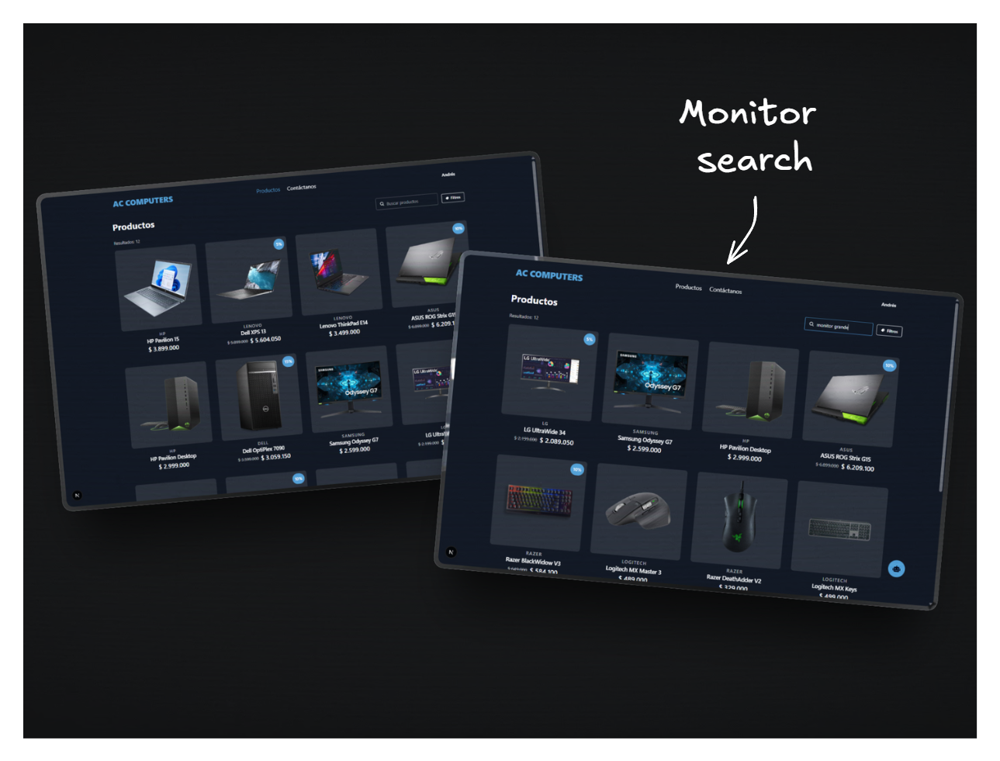

# 💻 AC Computers

[Versión en español](./README.es.md)

<div align="center">


</div>

AC Computers is a web application focused on the management, visualization, and commercialization of technology products, including computers, peripherals, and components. The system integrates a dynamic catalog with advanced search capabilities, AI-driven interaction, and automated content generation such as technical sheets and PDF documents.

The problem it addresses is the fragmentation between static catalogs, inventory management systems, and poor user experiences. This solution centralizes product management, improves exploration through filtering and semantic search, and optimizes conversion through intelligent assistants.

</img>

---

## 📑 Table of Contents

- [Key Features](#key-features)
- [Technologies Used](#technologies-used)
- [Architecture](#architecture)
- [Usage Flow](#usage-flow)
- [Installation](#installation)
- [Contact](#contact)

---

## ✨ Key Features

- **Dynamic user and product management:** Full administration of system entities, allowing controlled creation, updates, and deletion. Includes Google authentication with One Tap Login, reducing friction during sign-up and login.

</img>

</img>

- **Contact and digital presence:** Integration of email communication, social media links, and map-based location display. The interface is enhanced with scroll-based animations and 3D elements to improve user experience.

</img>

- **Structured product catalog:** Organized listing of computers, peripherals, and components with hierarchical categorization. Includes semantic search based on embeddings to interpret user intent, along with filters by price and features.

</img>

- **Detailed product view:** Complete page with images, description, category, subcategory, brand, and technical specifications. Includes an AI-generated overview that translates technical data into clear user benefits.

</img>

- **PDF catalog generation:** Automated creation of PDF documents with product information, useful for sharing or offline access.

</img>

- **AI-powered sales chat:** Conversational assistant that answers questions and recommends products using the internal search system, improving user decision-making.

</img>

---

## 🛠️ Technologies Used

**Frontend:**

- TypeScript
- React
- TailwindCSS v4
- DaisyUI
- GSAP
- Leaflet
- Valibot

**Backend:**

- Java 21
- Spring Boot
- iTextPDF
- Cloudinary SDK
- Ollama (AI integration)
- Caffeine

---

## 🏗️ Architecture

The system follows a hexagonal architecture, meaning the core business logic is isolated from technical details such as frameworks, databases, or external services. This enables scalability and flexibility without affecting the core logic.

### Domain Layer

This is the core of the system. It contains entities and business rules. It has no dependency on external libraries. Critical validations are defined here to ensure data consistency regardless of the source.

### Application Layer

Orchestrates use cases and defines how different parts of the system interact. It coordinates operations such as product search, PDF generation, and AI chat flows, delegating business logic to the domain.

### Infrastructure Layer

Implements technical details such as database access, cloud storage, email services, and embedding engines. It also includes caching mechanisms using Caffeine to improve performance.

Monitoring and traceability are handled through structured logging, enabling system behavior analysis and issue detection.

Security is implemented using role-based access control (RBAC), restricting actions based on defined permissions.

The use of patterns such as Mapper ensures the domain remains decoupled from persistence models.

### Frontend

The frontend follows Atomic Design, organizing the UI into atoms, molecules, organisms, and views. This enables building complex interfaces from small, reusable components.

Communication with the backend is handled via APIs, keeping the frontend decoupled from business logic and allowing independent evolution.

---

## 🔁 Usage Flow

The user accesses the platform and is first presented with a 3D model enhanced with scroll-based animations, highlighting the importance of downloading the product catalog as a PDF.

At the top, a navigation menu allows access to contact and product views. In the product section, users can explore the catalog using filters by price, category, or features.

When selecting a product, the user is taken to a detailed view with complete information and an automatically generated summary for quick understanding.

If the user has questions, they can interact with the AI chat, which uses vector search to recommend relevant products based on intent.

Users can contact the provider directly via email or access external links such as social media and location.

From the administrative side, products and users are managed dynamically, allowing real-time updates to the catalog.

---

## ⚙️ Installation

The project is divided into frontend and backend, so setup must be done separately.

**Frontend**

Install dependencies:

```bash
npm install
```

Create a `.env` file based on `.env.example` in the frontend root. This includes API endpoints and environment-specific configurations.

Run the development server:

```bash
npm run dev
```

**Backend**

Requires Java 21 and IntelliJ IDEA (or a compatible IDE) to run the Spring Boot application.

Environment variables are defined in `.env.example` inside the `server` directory. These must be configured before running.

The system also depends on a local AI service via Ollama. It must be running with the following models:

- **Embedding model:** `qwen3-embedding:4b`
- **Product overview model:** `qwen3.5:4b`
- **Chat model:** `qwen3:1.7b`

Once configured, the backend can be run directly from the IDE or using standard Spring Boot commands.

---

## 📬 Contact

For questions, support, or collaboration:

- Andrés Gutiérrez Hurtado
- Email: [andres52885241@gmail.com](mailto:andres52885241@gmail.com)
- LinkedIn: [https://www.linkedin.com/in/andresgh-dev](https://www.linkedin.com/in/andresgh-dev)
- GitHub: [https://github.com/AndresGutierrezHurtado](https://github.com/AndresGutierrezHurtado)
- Portfolio: [https://andres-portfolio-b4dv.onrender.com](https://andres-portfolio-b4dv.onrender.com)
